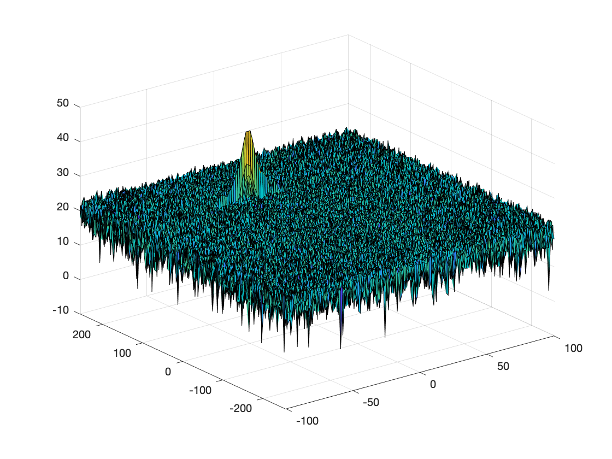

# SFND-Radar

Radar Target Generation and Detection

## FMCW Waveform Design
Using the given system requirements, design
a FMCW waveform. Find its Bandwidth (B), chirp time (Tchirp) and slope of the chirp.
For given system requirements the calculated slope should be around 2e13
The values defined are:
rangeResolution = 1;
c = 3*10^8;
Rmax = 200;

B = c/(2*rangeResolution);  %Bandwidth

Tchirp = 5.5*2*Rmax/c; %chirp time

slope = B/Tchirp; %slope of chirps

So slope value is 2.0455e+13. Around 2e13
## Simulation Loop
Simulate Target movement and calculate the beat or mixed signal for every timestamp.
A beat signal should be generated such that once range FFT implemented, it gives the correct range i.e the initial position of target assigned with an error margin of +/- 10 meters.

Is defined from line 63 to 84 of code.

## Range FFT (1st FFT)
Implement the Range FFT on the Beat or Mixed Signal and plot the result.
A correct implementation should generate a peak at the correct range, i.e the
initial position of target assigned with an error margin of +/- 10 meters.

## 2D CFAR
Implement the 2D CFAR process on the output of 2D FFT operation, i.e the Range Doppler Map.
The 2D CFAR processing should be able to suppress the noise and separate
the target signal. The output should match the image shared in walkthrough.

Is defined in code from lines 118 to 145.

Write brief explanations for the following:

**Implementation steps for the 2D CFAR process.**

* Loop over elements of RDM array each iteration selecting one cell to be the CUT (Cell Under Test) 
`for irange = Tr+Gr+1 : (Nr/2)-(Tr+Gr)` 
`for idoppler = Td+Gd+1 : Nd-(Td+Gd)`
* For each iteration sum training cells excluding the guarding cells 

* Calculate the average of the noise value 

* Convert using pow2db 

* Add the offset value

**Selection of Training, Guard cells and offset.**

* `Tr = 12, Td = 3` For both Range and Doppler Training Cells.
* `Gr = 4, Gd = 1` For both Range and Doppler Guard Cells.
* `offset = 15` the offset value.

**Steps taken to suppress the non-thresholded cells at the edges.**

The same loop is run again to suppress the non thresholded cell at the edges.

`for irange = Tr + Gr + 1 : Nr/2 - Tr - Gr`

	 `for idoppler = Td + Gd + 1 : Nd - Td - Gd`

        `if RDM(irange, idoppler) > threshold`

            `CFAR(irange, idoppler) = 1;`

        `end`

    `end`
`end`

